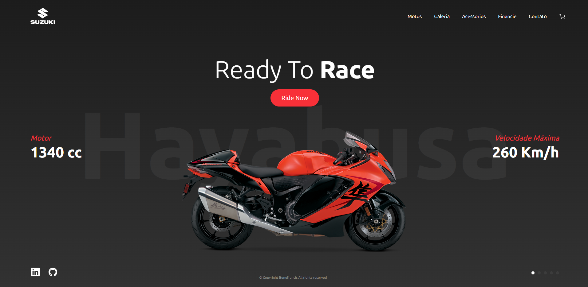
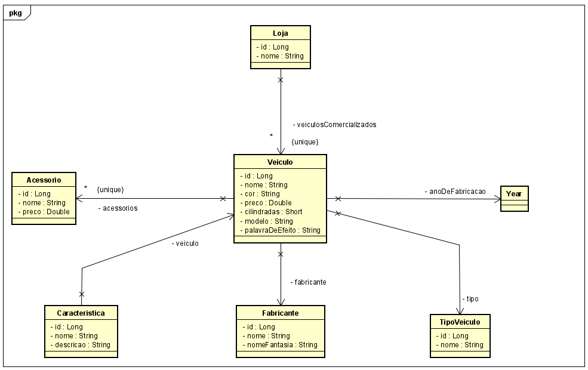
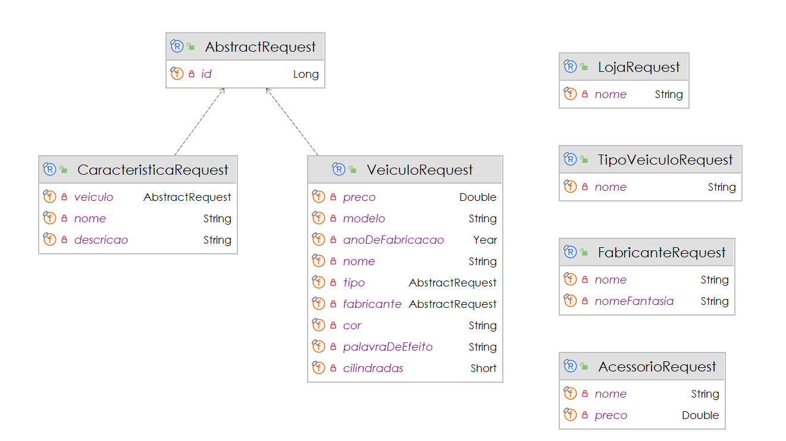
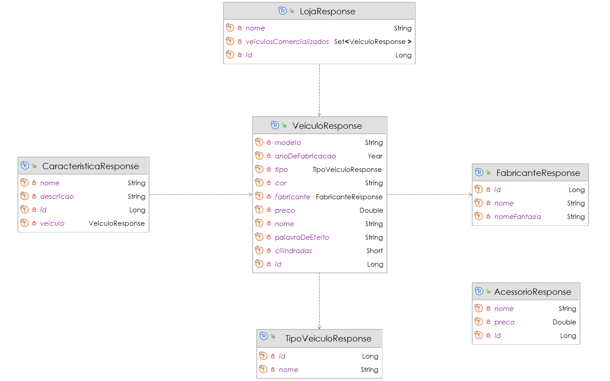

# Concessionárias - Projeto Faculdade

# Sumário

[Estudo de caso ](#_Estudo_de_caso)

[Diagrama de Classes ](#_Diagrama_de_Classes)

# Estudo de caso

A Holding Benezinho está interessada em investir na abertura de concessionárias de motos premium no Brasil em 2024. Este
investimento pode oferecer diversas vantagens para um empresário, especialmente considerando o contexto econômico e
social do país. Entre as principais vantagens destacam-se:

1. Margens de lucro mais elevadas: Motos premium geralmente têm preços mais altos e, portanto, podem oferecer margens de
   lucro mais generosas em comparação com modelos mais básicos. Isso pode resultar em maiores retornos financeiros para
   a concessionária.

2. Público-alvo específico: Clientes interessados em motos premium geralmente têm maior poder aquisitivo e estão
   dispostos a pagar mais por qualidade, desempenho e exclusividade. Isso pode resultar em um público-alvo mais fiel e
   menos sensível a flutuações econômicas.

3. Prestígio da marca: Representar marcas premium pode conferir prestígio à concessionária e aumentar sua reputação no
   mercado. Isso pode atrair clientes em busca de uma experiência de compra diferenciada e associar a concessionária a
   valores de qualidade e sofisticação.

4. Menos concorrência direta: O mercado de motos premium pode ser menos saturado do que o mercado de motos de massa, o
   que significa que a concorrência direta pode ser menor. Isso pode permitir que a concessionária estabeleça uma
   posição mais forte no mercado e capture uma fatia maior do público-alvo.

5. Oportunidades de serviços adicionais: Clientes de motos premium muitas vezes procuram um atendimento ao cliente
   excepcional e serviços personalizados. Isso pode abrir oportunidades para a concessionária oferecer serviços
   adicionais, como personalização de motos, eventos exclusivos para proprietários e programas de fidelidade.

Com o objetivo de fazer este negócio dar certo, idealizamos o desenvolvimento de um Sistema de Gestão de veículos a
serem comercializados pelas lojas da rede.

Criaremos, nesta aula, um Produto Mínimo Viável (PMV) de uma API Rest para um sistema para Sistema de Gestão de veículos
a serem comercializados.

Nossa equipe de analistas desenvolveu o Diagrama de Classes abaixo, e a sua missão aqui é realizar o Mapeamento Objeto
Relacional das classes de Entidade. Usaremos a JPA e o Hibernate como ferramentas de Mapeamento Objeto Relacional.

Na sprint atual, você foi incumbido de fazer:

1. O Mapeamento Objeto Relacional das primeiras classes envolvidas neste projeto de software;

2. A criação automatizada das tabelas no banco de dados Oracle;

3. A persistência de todos os dados, e;

4. A criação dos Seguintes Resources que devem implementar a ResourceDTO (foi fornecida):

    1. **VeiculoResource** com as seguintes ROTAS e VERBOS:

        1. "localhost/veiculos" - **GET by Example**, **POST**
        2. "logalhost/veiculos/{id}" - **GET**
        3. "logalhost/veiculos/{id}/acessorios" - **GET**, **POST**

    2. **AcessorioResource** com as seguintes ROTAS e VERBOS:

        1. "localhost/acessorios" - **GET by Example**, **POST**
        2. "logalhost/acessorios/{id}" - **GET**

    3. **LojaResource** com as seguintes ROTAS e VERBOS:

        1. "localhost/lojas" - **GET by Example**, **POST**
        2. "logalhost/lojas/{id}" - **GET**
        3. "logalhost/lojas/{id}/veiculos" - **GET**, **POST**

    4. **TipoVeiculoResource** com as seguintes ROTAS e VERBOS:

        1. "localhost/tipos" - **GET by Example**, **POST**
        2. "logalhost/tipos/{id}" - **GET**

    5. **CaracteristicaResource** com as seguintes ROTAS e VERBOS:

        1. "localhost/caracteristicas" - **GET by Example**, **POST**
        2. "logalhost/caracteristicas/{id}" - **GET**

    6. **FabricanteResource** com as seguintes ROTAS e VERBOS:
        1. "localhost/fabricantes" - **GET by Example**, **POST**
        2. "logalhost/fabricantes/{id}" - **GET**

5. A criação dos Seguintes Services que devem implementar a ServiceDTO (foi fornecida):

    1. **AcessorioService**
    2. **CaracteristicaService**
    3. **FabricanteService**
    4. **LojaService**
    5. **TipoVeiculoService**
    6. **VeiculoService**

6. A criação dos Seguintes DTOs (Objetos de Transferência de Dados) de Request e de Response:

    1. **AcessorioRequest** e **AcessorioResponse**
    2. **CaracteristicaRequest** e **CaracteristicaResponse**
    3. **FabricanteRequest** e **FabricanteResponse**
    4. **TipoVeiculoRequest** e **TipoVeiculoResponse**
    5. **VeiculoRequest** e **VeiculoResponse**
    6. **AbstractRequest**

# Diagrama de Classes de Entidade

# Diagrama de Classes de Request

# Diagrama de Classes de Response

